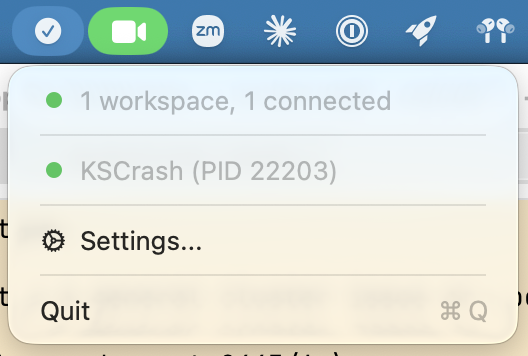
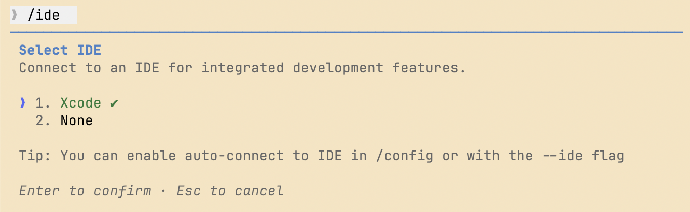
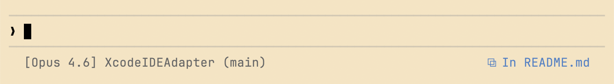
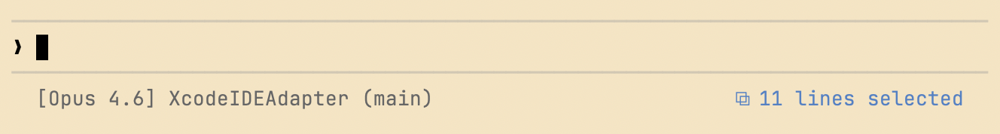
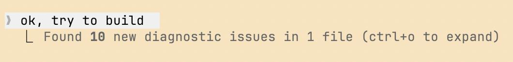

# CC Xcode Connect

A macOS menu bar app that enables the `/ide` integration for [Claude Code](https://claude.ai/code) — so it can see your current file, cursor position, and diagnostics in Xcode.


In Claude Code:






## Requirements

- macOS 14+
- Xcode 26.3+ (for `xcrun mcpbridge` support)
- [Claude Code CLI](https://docs.anthropic.com/en/docs/claude-code)

## Install

### Homebrew (recommended)

```bash
brew install --cask GLinnik21/tap/cc-xcode-connect
```

On first launch, macOS will block it because the app is not notarized. Go to **System Settings > Privacy & Security** and click **Open Anyway**.

### Download

Grab the latest `.zip` from [Releases](https://github.com/GLinnik21/CCXcodeConnect/releases), extract, and move to `/Applications`. On first launch, go to **System Settings > Privacy & Security** and click **Open Anyway**.

### Build from source

```bash
make install
```

The app registers as a login item and launches automatically at login.

## Uninstall

```bash
brew uninstall cc-xcode-connect
```

Or if installed manually:

```bash
make uninstall
```

## CLI

The headless CLI can also be used directly:

```bash
swift run cc-xcode-connect                    # supervisor mode (auto-manages all workspaces)
swift run cc-xcode-connect --workspace /path  # single targeted workspace
```

## Usage

1. Install the app (see [Install](#install) above)
2. On each Xcode launch, macOS will ask to allow CC Xcode Connect to connect to Xcode — click **OK** to grant the automation permission
3. Open one or more projects in Xcode — the adapter appears in the menu bar
4. In each Claude Code session, run `/ide` to connect to the matching workspace
5. Claude Code can now see your active file, cursor position, and diagnostics

Each Xcode window gets its own adapter instance with a dedicated WebSocket port and lock file. Multiple Claude Code clients can connect to the same workspace simultaneously.

## Architecture

The app registers as a login item via `SMAppService` and:

- Runs an `AdapterSupervisor` that monitors Xcode for open workspaces
- Creates one `AdapterServer` per workspace, each with its own WebSocket port and lock file
- Shares a single `xcrun mcpbridge` connection across all workspaces (routed by `tabIdentifier`)
- Polls for editor context (active file, selection) via AppleScript, filtered per workspace
- Supports multiple Claude Code clients per workspace (notifications broadcast, responses routed)
